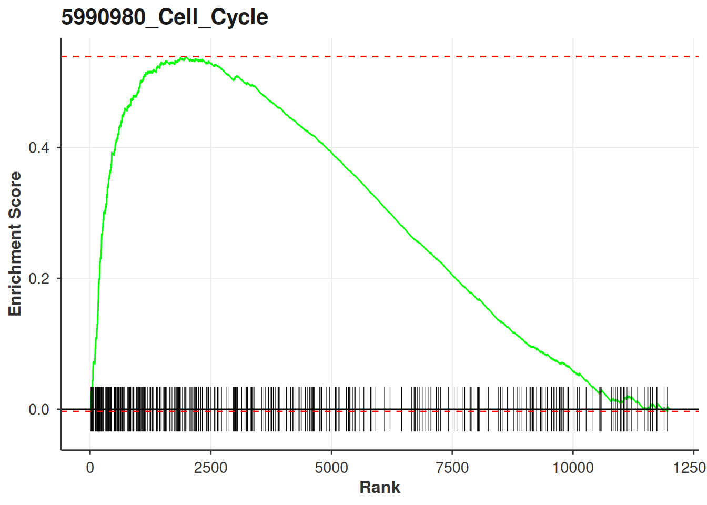
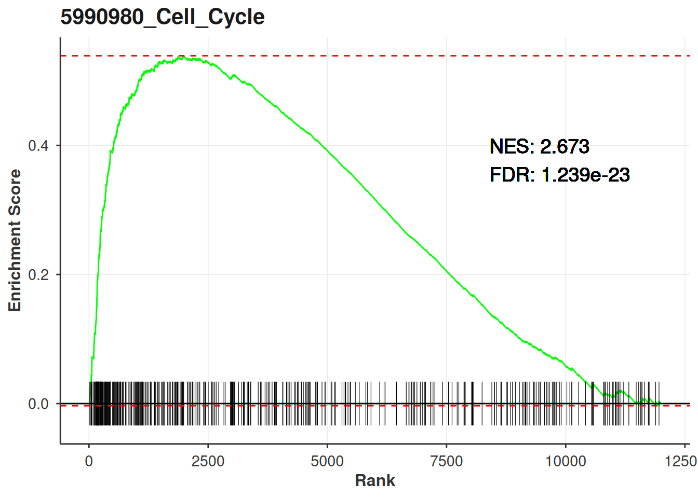
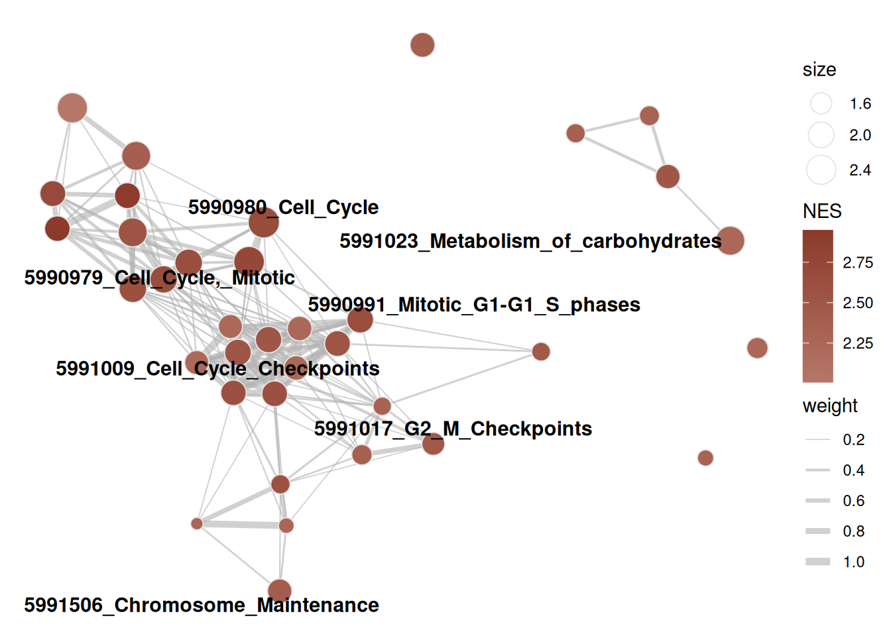
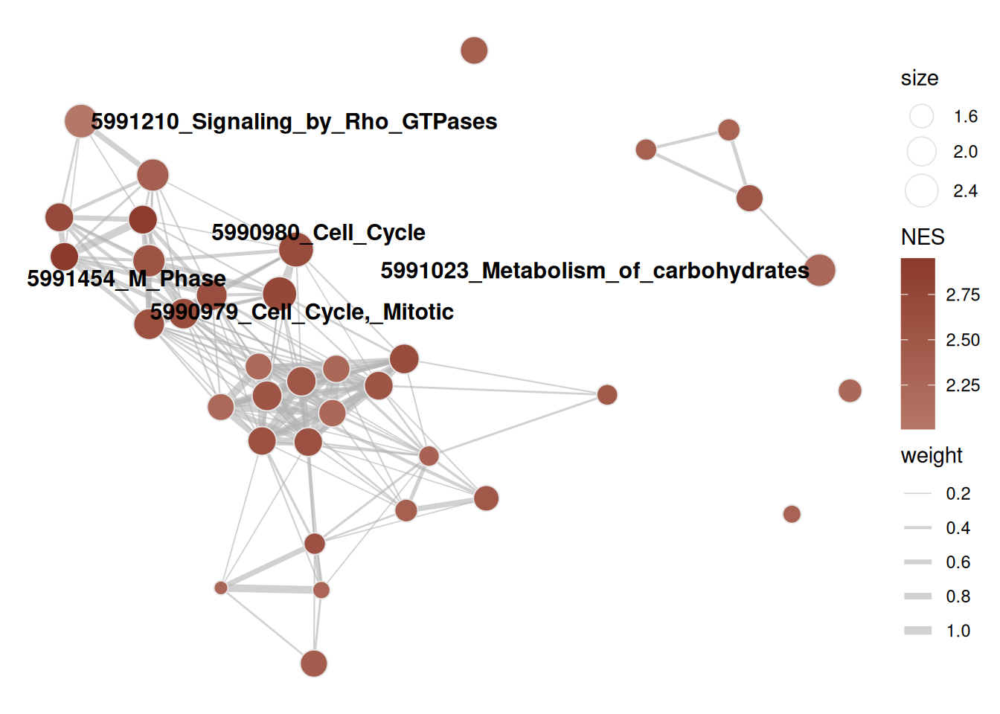
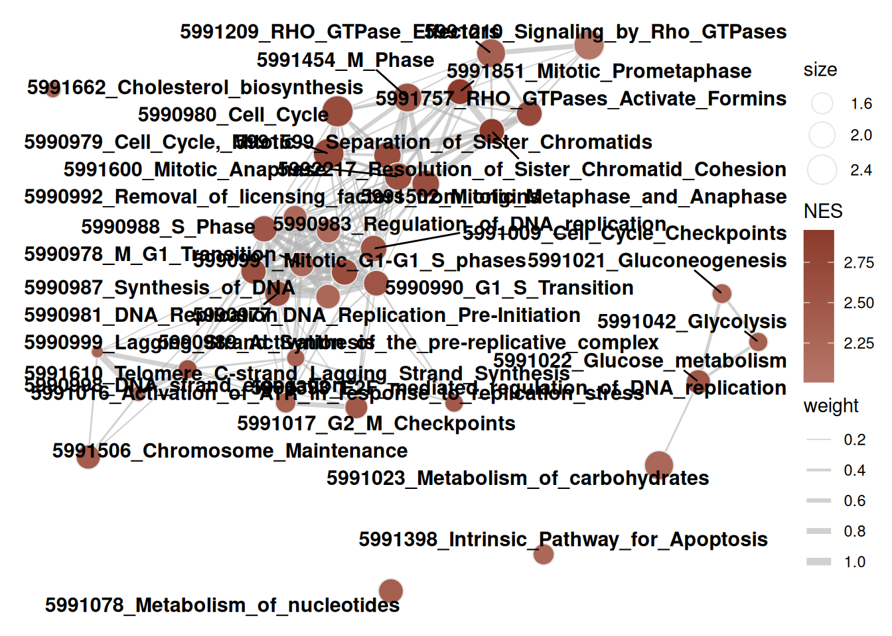
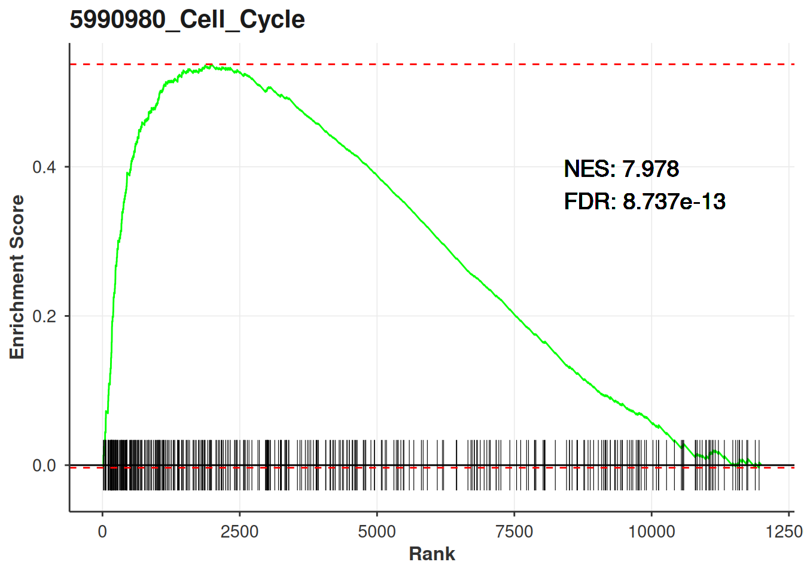
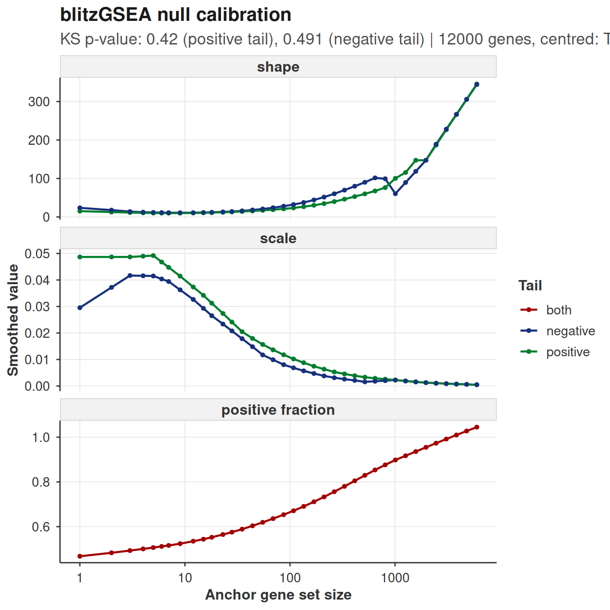
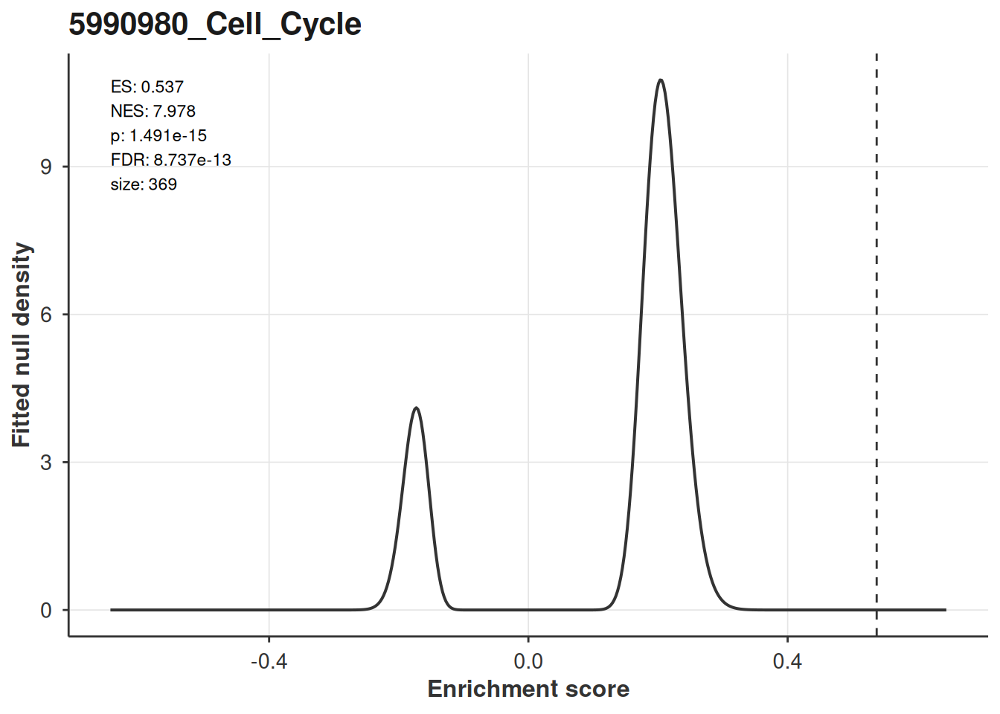
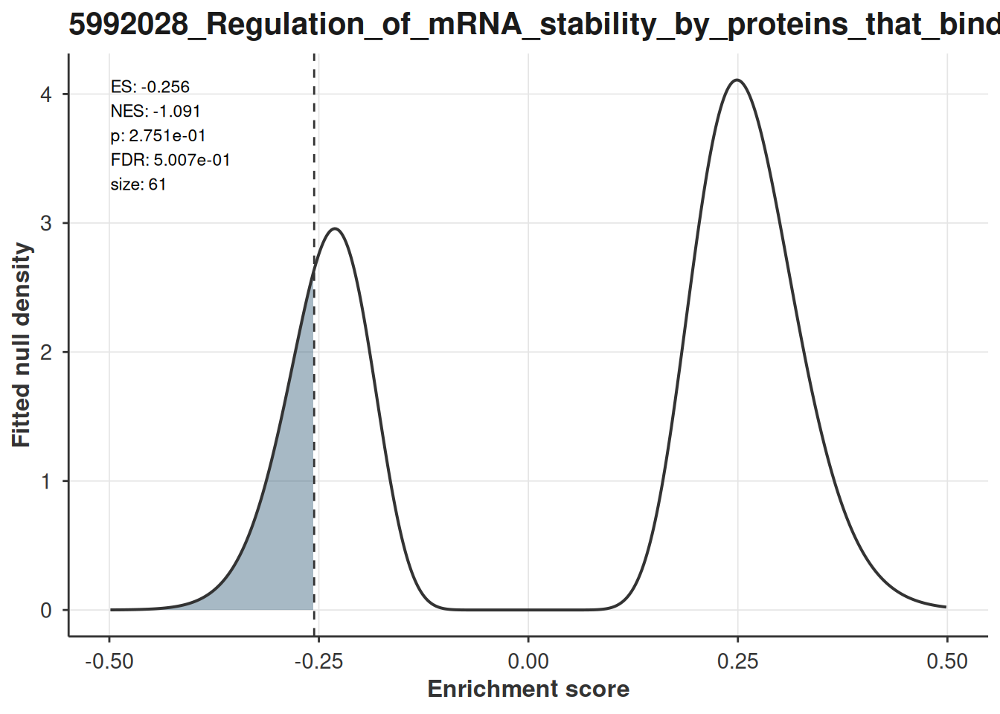

# Visualising GSEA results

## Intro

`bixverse` gives you ranked gene set enrichment through
[`calc_fgsea()`](https://gregorlueg.github.io/bixverse/reference/calc_fgsea.html)
and
[`calc_blitzgsea()`](https://gregorlueg.github.io/bixverse/reference/calc_blitzgsea.html).
This vignette covers what to do with the results: running enrichment
curves, enrichment maps, and the calibration diagnostics that only
blitzGSEA has.

For the methods themselves, see the [gene set enrichment
vignette](https://gregorlueg.github.io/bixverse/articles/gse_methods.html)
in the parent package. This one assumes you already have results in
hand.

``` r

library(bixverse)
library(bixverse.plots)
library(data.table)
#> 
#> Attaching package: 'data.table'
#> The following object is masked from 'package:base':
#> 
#>     %notin%
library(ggplot2)
library(magrittr)
```

## The data

`fgsea` ships a mouse ranked list and a set of Reactome pathways. 12,000
genes, 586 pathways, and enough real signal to make the plots worth
looking at.

``` r

data(examplePathways, package = "fgsea")
data(exampleRanks, package = "fgsea")

stats <- sort(exampleRanks, decreasing = TRUE)

gsea_res <- calc_fgsea(
  stats = stats,
  pathways = examplePathways,
  gsea_params = params_gsea(min_size = 15L)
)

head(gsea_res[, .(pathway_name, es, nes, pvals, fdr)])
#>                                       pathway_name        es      nes
#>                                             <char>     <num>    <num>
#> 1:                              5990980_Cell_Cycle 0.5388497 2.673307
#> 2:                     5990979_Cell_Cycle,_Mitotic 0.5594755 2.740700
#> 3:                    5991851_Mitotic_Prometaphase 0.7253270 2.933140
#> 4: 5992217_Resolution_of_Sister_Chromatid_Cohesion 0.7347987 2.948932
#> 5:         5991599_Separation_of_Sister_Chromatids 0.6164600 2.661126
#> 6:                                 5991454_M_Phase 0.5576247 2.544186
#>           pvals          fdr
#>           <num>        <num>
#> 1: 4.157296e-26 1.239167e-23
#> 2: 4.229239e-26 1.239167e-23
#> 3: 9.357720e-19 1.827875e-16
#> 4: 1.027876e-17 1.505838e-15
#> 5: 1.701775e-14 1.994480e-12
#> 6: 2.221182e-14 2.169354e-12
```

## Enrichment plots

[`plot_gsea_enrichment()`](https://gregorlueg.github.io/bixverse.plots/reference/plot_gsea_enrichment.md)
draws the classical GSEA figure: the running enrichment score across the
ranked list, a rug of where the pathway genes sit, and the ranked
statistic underneath. It returns a **named list**, one ggplot per
pathway, so you can plot a handful in one call.

``` r

top_pathways <- gsea_res[1:2, pathway_name]

plots <- plot_gsea_enrichment(
  stats = stats,
  pathways = examplePathways,
  pathways_of_interest = top_pathways
)

plots[[1]]
```



Running enrichment score for the top two hits.

Hand it the results table as well and it annotates each panel with the
NES and FDR. Worth doing: a running score curve on its own tells you the
shape of the enrichment but nothing about whether it is significant.

``` r

plots <- plot_gsea_enrichment(
  stats = stats,
  pathways = examplePathways,
  pathways_of_interest = top_pathways,
  gsea_results = gsea_res
)

plots[[1]]
```



Same pathway, now with NES and FDR from the results table.

**Key arguments:**

| Argument | Description |
|----|----|
| `stats` | Named numeric vector of the gene level statistic. Sort it descending. |
| `pathways` | The full named list you ran the enrichment on, not just the ones you are plotting. |
| `pathways_of_interest` | Which pathways to draw. Every one has to be in `names(pathways)`. |
| `gsea_results` | Optional. Needs `pathway_name`, `nes` and `fdr`, which is what [`calc_fgsea()`](https://gregorlueg.github.io/bixverse/reference/calc_fgsea.html) and [`calc_blitzgsea()`](https://gregorlueg.github.io/bixverse/reference/calc_blitzgsea.html) both return. |
| `tick_size` | Height of the rug ticks. |
| `text_size` | Size of the NES/FDR annotation. Only does anything when `gsea_results` is given. |

Note the size filter: the function drops pathways with fewer than three
genes present in `stats`, and they disappear from the returned list
without comment. If you get back fewer plots than you asked for, that is
why.

**Extracting the plotting data**

Alternatively, you can pull the underlying data out and build your own
plot.
[`get_gsea_enrichment_data()`](https://gregorlueg.github.io/bixverse.plots/reference/get_gsea_enrichment_data.md)
returns the curve, the tick positions and the key points per pathway.

``` r

enrichment_data <- get_gsea_enrichment_data(
  stats = stats,
  pathways = examplePathways,
  pathways_of_interest = top_pathways,
  gsea_results = gsea_res
)

str(enrichment_data[[1]], max.level = 1)
#> List of 5
#>  $ curve_dt        :Classes 'data.table' and 'data.frame':   740 obs. of  2 variables:
#>   ..- attr(*, ".internal.selfref")=<pointer: 0x555d8f78fb80> 
#>  $ ticks_dt        :Classes 'data.table' and 'data.frame':   369 obs. of  2 variables:
#>   ..- attr(*, ".internal.selfref")=<pointer: 0x555d8f78fb80> 
#>  $ stats_dt        :Classes 'data.table' and 'data.frame':   12000 obs. of  2 variables:
#>   ..- attr(*, ".internal.selfref")=<pointer: 0x555d8f78fb80> 
#>  $ key_points      : Named num [1:5] 5.39e-01 -3.38e-03 5.42e-01 2.67 1.24e-23
#>   ..- attr(*, "names")= chr [1:5] "pos_es" "neg_es" "spread_es" "nes" ...
#>  $ additional_label: logi TRUE
#>  - attr(*, "class")= chr "gsea_par_plot_data"

head(enrichment_data[[1]]$curve_dt)
#>     rank           ES
#>    <num>        <num>
#> 1:     0  0.000000000
#> 2:    16 -0.001375634
#> 3:    17  0.013232526
#> 4:    24  0.012630686
#> 5:    25  0.024877964
#> 6:    42  0.023416353
```

## Enrichment maps

Ranked enrichment on a library like Reactome gives you a lot of hits
that are mostly the same genes wearing different names. An enrichment
map makes that redundancy visible: gene sets become nodes, similarity
between them becomes edges, and Louvain clustering groups the ones that
are telling you the same thing.

[`enrichment_map_gsea()`](https://gregorlueg.github.io/bixverse.plots/reference/enrichment_map_gsea.md)
builds the `igraph`. It takes
[`calc_fgsea()`](https://gregorlueg.github.io/bixverse/reference/calc_fgsea.html)
output directly.

``` r

enrichment_map <- enrichment_map_gsea(
  res = gsea_res,
  threshold = 1e-4,
  pathways = examplePathways,
  min_sim = 0.2,
  resolution = 1.0
)

enrichment_map
#> IGRAPH 3826639 UNW- 36 172 -- 
#> + attr: layout (g/n), color_type (g/c), name (v/c), size (v/n),
#> | community (v/n), label (v/c), nes (v/n), color_value (v/n), weight
#> | (e/n)
#> + edges from 3826639 (vertex names):
#> [1] 5990977_DNA_Replication_Pre-Initiation--5990978_M_G1_Transition               
#> [2] 5990981_DNA_Replication               --5990977_DNA_Replication_Pre-Initiation
#> [3] 5990977_DNA_Replication_Pre-Initiation--5990983_Regulation_of_DNA_replication 
#> [4] 5990987_Synthesis_of_DNA              --5990977_DNA_Replication_Pre-Initiation
#> [5] 5990988_S_Phase                       --5990977_DNA_Replication_Pre-Initiation
#> + ... omitted several edges
```

Nodes are sized by `log10` of the gene set size and coloured by NES. The
graph carries its own layout, so the two renderers below agree on where
things sit.

``` r

plot_enrichment_map_ggraph(enrichment_map, label_nodes = "adaptive")
#> Warning: Removed 29 rows containing missing values or values outside the scale range
#> (`geom_text_repel()`).
```



Enrichment map, adaptive labelling.

Labelling is the part you will actually tune. `"adaptive"` scales the
number of labels to the community size, which keeps big clusters
readable; `"all"` labels everything and works up to maybe thirty nodes;
an integer takes the top N by node size; `NULL` drops labels entirely.

``` r

plot_enrichment_map_ggraph(enrichment_map, label_nodes = 5L)
#> Warning: Removed 31 rows containing missing values or values outside the scale range
#> (`geom_text_repel()`).
```



Top five nodes by size, everything else left bare.

Long Reactome names need wrapping. `...` goes straight to
[`wrap_and_truncate()`](https://gregorlueg.github.io/bixverse.plots/reference/wrap_and_truncate.md),
so `width` and `max_lines` are set when you build the graph, not when
you plot it.

``` r

enrichment_map_short <- enrichment_map_gsea(
  res = gsea_res,
  threshold = 1e-4,
  pathways = examplePathways,
  width = 25L,
  max_lines = 2L
)

plot_enrichment_map_ggraph(enrichment_map_short, label_nodes = "all")
```



Shorter labels via wrap_and_truncate().

For anything beyond a handful of nodes the static version stops being
useful and you want to hover.
[`plot_enrichment_map_visnetwork()`](https://gregorlueg.github.io/bixverse.plots/reference/plot_enrichment_map_visnetwork.md)
takes the same graph and gives you an interactive widget, same colours
and same layout.

``` r

plot_enrichment_map_visnetwork(enrichment_map)
```

## blitzGSEA

blitzGSEA calibrates a gamma null once against the signature and then
reads every pathway’s p-value off the fitted tail. Cost per pathway
collapses, which is what makes it worth using on large libraries. The
results table has the same `pathway_name`, `nes` and `fdr` columns as
[`calc_fgsea()`](https://gregorlueg.github.io/bixverse/reference/calc_fgsea.html),
so everything above works on it unchanged.

``` r

blitz_params <- params_blitzgsea(min_size = 15L)

null_model <- blitzgsea_calibrate(
  stats = stats,
  blitz_params = blitz_params
)

blitz_res <- calc_blitzgsea(
  stats = stats,
  pathways = examplePathways,
  blitz_params = blitz_params,
  null_model = null_model
)

head(blitz_res[, .(pathway_name, es, nes, pvals, fdr, size)])
#>                                       pathway_name        es      nes
#>                                             <char>     <num>    <num>
#> 1:                              5990980_Cell_Cycle 0.5373426 7.977693
#> 2:                     5990979_Cell_Cycle,_Mitotic 0.5579853 7.860540
#> 3:                                 5991454_M_Phase 0.5558732 5.985000
#> 4:                    5991851_Mitotic_Prometaphase 0.7243143 5.964933
#> 5: 5992217_Resolution_of_Sister_Chromatid_Cohesion 0.7337666 5.803762
#> 6:          5991502_Mitotic_Metaphase_and_Anaphase 0.6038215 5.697086
#>           pvals          fdr  size
#>           <num>        <num> <num>
#> 1: 1.490940e-15 8.736906e-13   369
#> 2: 3.824815e-15 1.120671e-12   317
#> 3: 2.163902e-09 3.585367e-07   173
#> 4: 2.447350e-09 3.585367e-07    82
#> 5: 6.484348e-09 7.599656e-07    74
#> 6: 1.218724e-08 1.033659e-06   123
```

### Centre your stats before drawing the curve

One trap.
[`params_blitzgsea()`](https://gregorlueg.github.io/bixverse/reference/params_blitzgsea.html)
defaults to `centre = TRUE`, and the enrichment score is not invariant
to an offset: the walk weights each gene by `|stat|^p`, so shifting the
statistic changes the score.
[`plot_gsea_enrichment()`](https://gregorlueg.github.io/bixverse.plots/reference/plot_gsea_enrichment.md)
draws the uncentred walk. Hand it the raw ranks next to
[`calc_blitzgsea()`](https://gregorlueg.github.io/bixverse/reference/calc_blitzgsea.html)
output and the curve peaks somewhere other than the `es` in the table.

Subtract the mean and they line up exactly:

``` r

top_blitz <- blitz_res[1, pathway_name]

peak_of <- function(s) {
  d <- get_gsea_enrichment_data(
    stats = s,
    pathways = examplePathways,
    pathways_of_interest = top_blitz
  )
  kp <- d[[1]]$key_points
  kp[which.max(abs(kp[c("pos_es", "neg_es")]))]
}

c(
  reported = blitz_res[1, es],
  raw = peak_of(stats),
  centred = peak_of(stats - mean(stats))
)
#>       reported     raw.pos_es centred.pos_es 
#>      0.5373426      0.5388497      0.5373426
```

So centre first:

``` r

plot_gsea_enrichment(
  stats = stats - mean(stats),
  pathways = examplePathways,
  pathways_of_interest = top_blitz,
  gsea_results = blitz_res
)[[1]]
```



blitzGSEA hit, drawn on the centred signature.

Running
[`calc_fgsea()`](https://gregorlueg.github.io/bixverse/reference/calc_fgsea.html)
instead? Then leave the stats alone. Only blitzGSEA centres.

### Is the calibration any good?

Everything blitzGSEA reports rests on the gamma fits describing the
permutation scores.
[`plot_blitzgsea_null()`](https://gregorlueg.github.io/bixverse.plots/reference/plot_blitzgsea_null.md)
shows the smoothed parameters across the anchor grid, one line per tail,
with the Kolmogorov-Smirnov goodness-of-fit p-values in the subtitle.

``` r

plot_blitzgsea_null(null_model)
```



Smoothed gamma parameters across the anchor grid.

What you want is smooth curves and KS p-values comfortably above 0.05.
Sharp kinks or a fit that sags at one end of the size range mean the
tails are misbehaving for gene sets of that size, and the p-values there
are optimistic. More permutations is the usual fix.
[`calc_blitzgsea()`](https://gregorlueg.github.io/bixverse/reference/calc_blitzgsea.html)
warns on its own when the mean KS p-value drops below 0.05, but the
warning is one number for the whole grid and this plot tells you *where*
it went wrong.

The calibration depends only on the signature, never on the library.
Score five libraries against one ranking and you pay for this once,
which is why
[`blitzgsea_calibrate()`](https://gregorlueg.github.io/bixverse/reference/blitzgsea_calibrate.html)
hands the null back as a plain list you can
[`saveRDS()`](https://rdrr.io/r/base/readRDS.html).

### Where the p-value comes from

[`plot_blitzgsea_es_null()`](https://gregorlueg.github.io/bixverse.plots/reference/plot_blitzgsea_es_null.md)
puts the observed score on the fitted null at that pathway’s size, with
the tail beyond it shaded. That shaded area, doubled, is the p-value in
the results table.

``` r

es_plots <- plot_blitzgsea_es_null(
  null_model = null_model,
  res = blitz_res,
  pathways_of_interest = blitz_res[1:2, pathway_name]
)

es_plots[[1]]
```



Observed enrichment score against the fitted null.

The gamma parameters are interpolated log-linearly from the anchor grid
to the pathway’s exact size, matching what the Rust does when it scores.
This is the fitted density, not a histogram: the permutation draws never
leave Rust, so there is no empirical null to overlay on it.

A non-significant pathway looks like what you would expect, the score
sitting in the body of the distribution:

``` r

boring <- blitz_res[fdr > 0.5][1, pathway_name]

plot_blitzgsea_es_null(
  null_model = null_model,
  res = blitz_res,
  pathways_of_interest = boring
)[[1]]
```



A pathway that is not going anywhere.

## Related

Over-representation results (hypergeometric tests) get their own
plotting helpers, covered in the [ORA
vignette](https://gregorlueg.github.io/bixverse.plots/articles/ora_visualisation.html).
Both vignettes use the same dataset, so the enrichment maps there are
directly comparable to the ones here.
