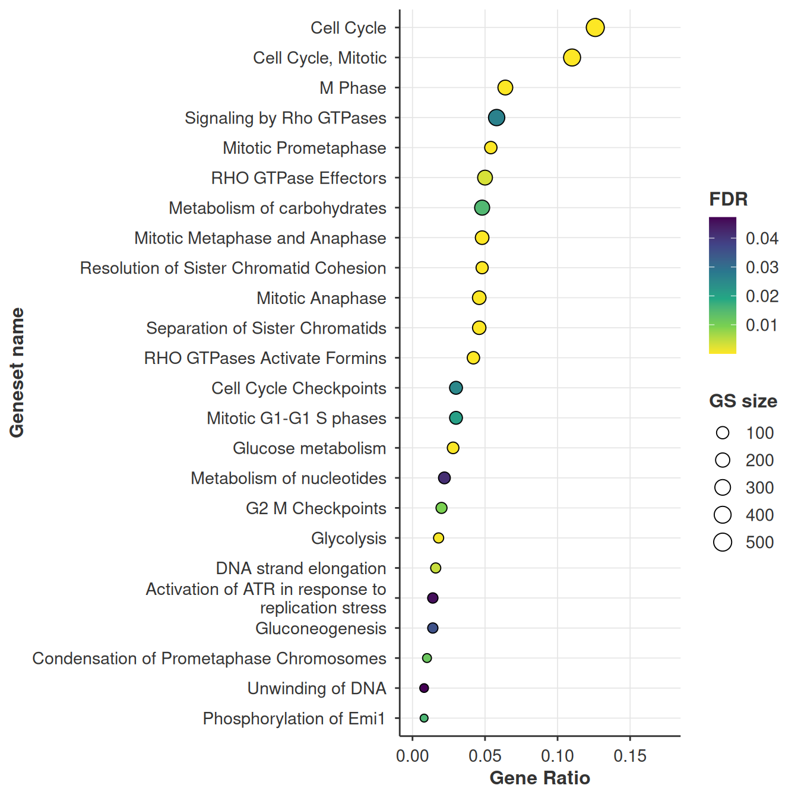
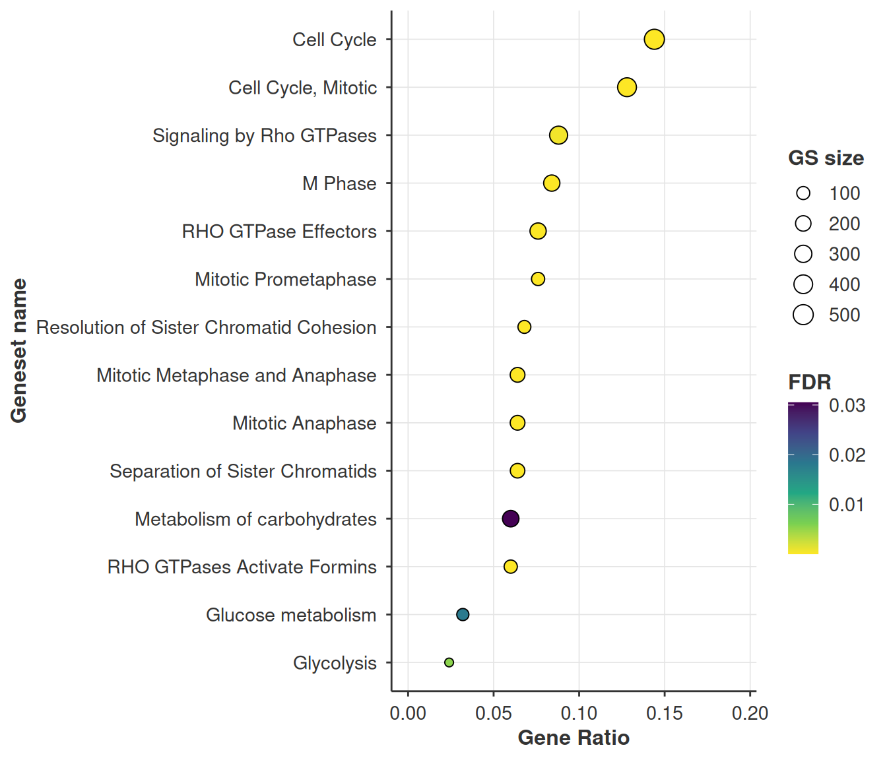
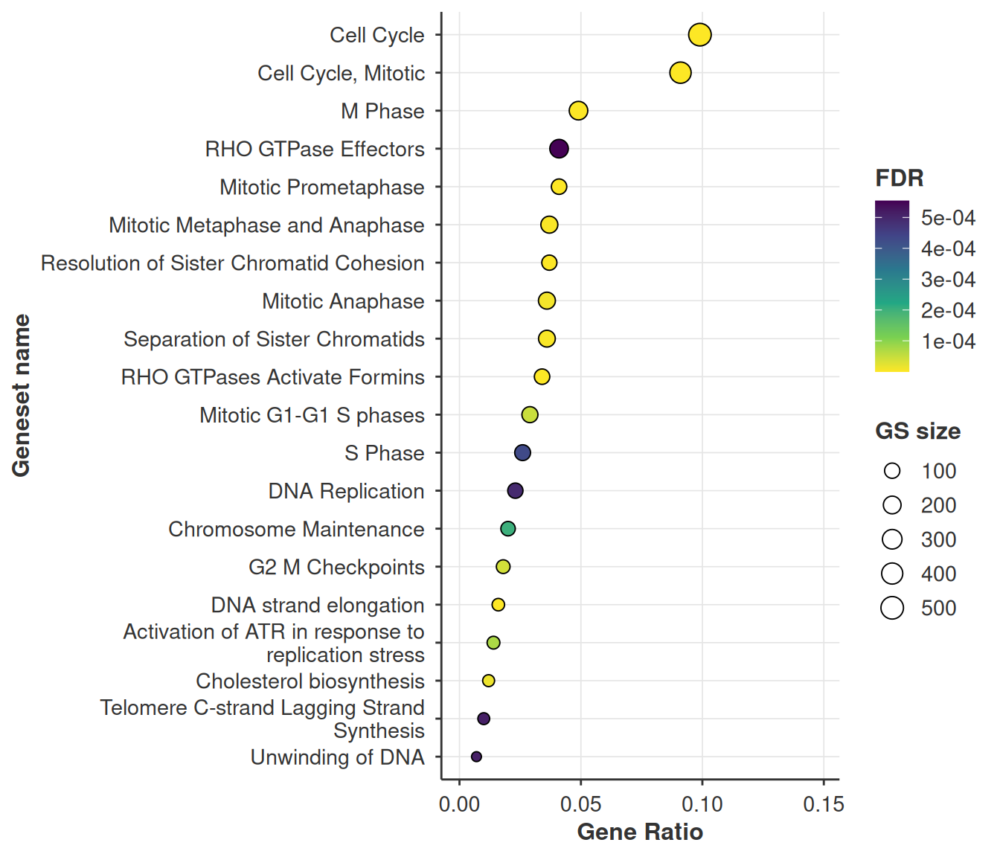
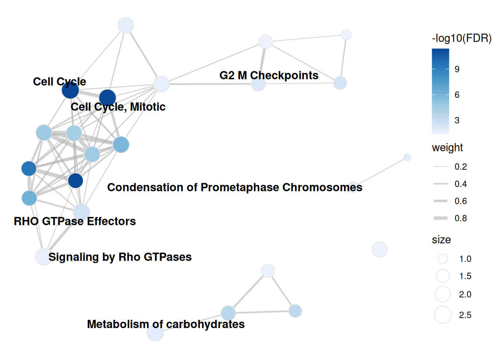
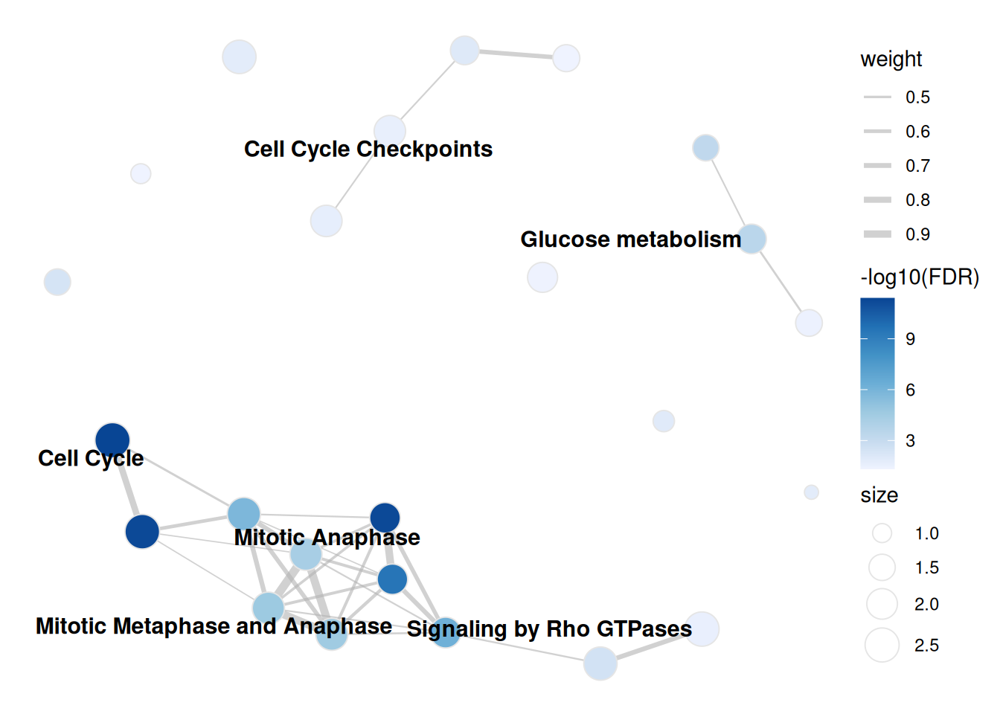
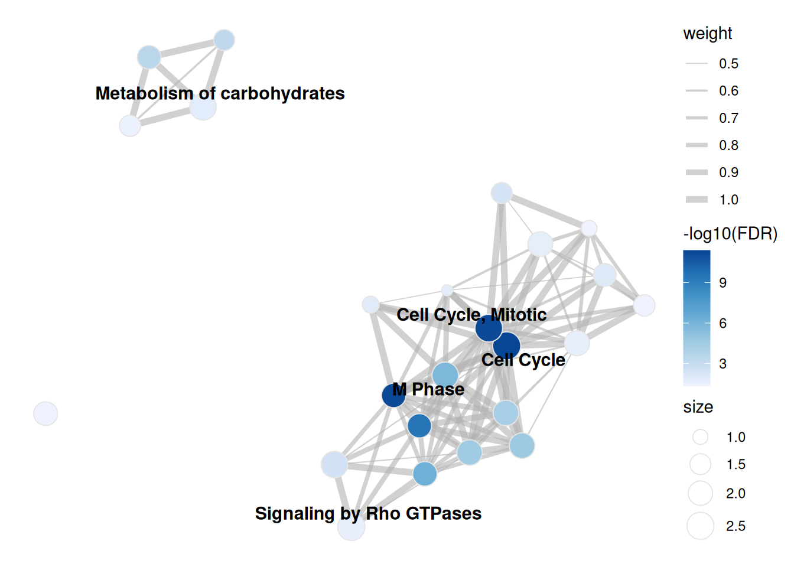

# Visualising over-representation results

## Intro

Over-representation analysis takes a discrete gene list and asks which
gene sets it overlaps more than chance would allow. `bixverse` does the
hypergeometric test through
[`gse_hypergeometric()`](https://gregorlueg.github.io/bixverse/reference/gse_hypergeometric.html)
and
[`gse_hypergeometric_list()`](https://gregorlueg.github.io/bixverse/reference/gse_hypergeometric_list.html).
This vignette covers the plotting side: dot plots and enrichment maps.

For the test itself and the GO-aware variants, see the [gene set
enrichment
vignette](https://gregorlueg.github.io/bixverse/articles/gse_methods.html)
in the parent package.

``` r

library(bixverse)
library(bixverse.plots)
library(data.table)
#> 
#> Attaching package: 'data.table'
#> The following object is masked from 'package:base':
#> 
#>     %notin%
library(ggplot2)
library(magrittr)
```

## The data

Same mouse ranking and Reactome pathways as the [GSEA
vignette](https://gregorlueg.github.io/bixverse.plots/articles/gsea_visualisation.html),
so the enrichment maps in the two are directly comparable. ORA needs a
discrete list, so we cut the ranking at the top 500 genes and use the
full measured set as the universe.

Picking the universe properly matters more than people give it credit
for. All 12,000 measured genes is the right call here; the union of the
library would quietly assume every gene in Reactome was assayed.

``` r

data(examplePathways, package = "fgsea")
data(exampleRanks, package = "fgsea")

stats <- sort(exampleRanks, decreasing = TRUE)
gene_universe <- names(stats)

# the numeric Reactome prefix carries nothing and the underscores make for
# ugly labels. Clean the names once, up front
pathways <- examplePathways
names(pathways) <- gsub("_", " ", gsub("^\\d+_", "", names(pathways)))

target_genes <- head(gene_universe, 500)

ora_res <- gse_hypergeometric(
  target_genes = target_genes,
  gene_set_list = pathways,
  gene_universe = gene_universe,
  threshold = 0.05
)

head(ora_res)
#>                              gene_set_name odds_ratios        pvals
#>                                     <char>       <num>        <num>
#> 1:                              Cell Cycle    3.606728 2.767505e-15
#> 2:                     Cell Cycle, Mitotic    3.857772 1.066533e-14
#> 3:                    Mitotic Prometaphase    8.358920 1.154958e-14
#> 4: Resolution of Sister Chromatid Cohesion    7.892483 8.862807e-13
#> 5:            RHO GTPases Activate Formins    5.887634 2.011143e-09
#> 6:                                 M Phase    3.676028 6.335464e-09
#>             fdr  hits gene_set_lengths target_set_lengths
#>           <num> <num>            <num>              <int>
#> 1: 4.032255e-12    63              505                500
#> 2: 5.609247e-12    55              412                500
#> 3: 5.609247e-12    27              105                500
#> 4: 3.228277e-10    24               97                500
#> 5: 5.860471e-07    21              106                500
#> 6: 1.538462e-06    32              242                500
```

## Dot plots

[`plot_gse_dotplot()`](https://gregorlueg.github.io/bixverse.plots/reference/plot_gse_dotplot.md)
takes the results table straight from
[`gse_hypergeometric()`](https://gregorlueg.github.io/bixverse/reference/gse_hypergeometric.html).

``` r

plot_gse_dotplot(ora_res)
```



Over-represented Reactome pathways in the top 500 genes.

Four things are encoded and only two of them are obvious, so: the x axis
is the gene ratio, `hits / target_set_lengths`, i.e. the fraction of
your input list that landed in the set. Pathways are ordered by that
same ratio. Fill is FDR and point size is the size of the gene set.

That last one is the pairing to read carefully. A big point far to the
right is a large gene set swallowing a large chunk of your list, which
is usually less interesting than a small point at the same x position.

**Key arguments:**

| Argument | Description |
|----|----|
| `res` | Results table. Needs `hits`, `target_set_lengths`, `gene_set_name`, `gene_set_lengths` and `fdr`. |
| `size_range` | Point size range, smallest to largest gene set. |
| `viridis_option` | Which viridis map to use for the fill, `"A"` through `"H"`. |
| `direction` | `1` or `-1`, flips the fill scale. |
| `max_terms` | Keep only the N most significant sets. Defaults to `NULL`, everything. |
| `.verbose` | Silences the message about splitting when several target sets are present. |
| `...` | Forwarded to [`wrap_and_truncate()`](https://gregorlueg.github.io/bixverse.plots/reference/wrap_and_truncate.md), which shortens the labels. `width` and `max_lines` are the ones you want. |

### Several target sets at once

[`gse_hypergeometric_list()`](https://gregorlueg.github.io/bixverse/reference/gse_hypergeometric_list.html)
tests many lists in one go and adds a `target_set_name` column.
[`plot_gse_dotplot()`](https://gregorlueg.github.io/bixverse.plots/reference/plot_gse_dotplot.md)
picks that up and returns a named list of plots rather than a single
one.

ORA depends on where you cut the ranking, and it is worth seeing how
much. Same statistic, three thresholds:

``` r

target_list <- list(
  top_250 = head(gene_universe, 250),
  top_500 = head(gene_universe, 500),
  top_1000 = head(gene_universe, 1000)
)

ora_res_ls <- gse_hypergeometric_list(
  target_genes_list = target_list,
  gene_set_list = pathways,
  gene_universe = gene_universe,
  threshold = 0.05
)

ora_res_ls[, .N, by = target_set_name]
#>    target_set_name     N
#>             <char> <int>
#> 1:        top_1000    54
#> 2:         top_500    24
#> 3:         top_250    14
```

14, 24 and 54 significant pathways off one ranking, with 13 common to
all three. The cell cycle story survives every cut, which is reassuring,
but the long tail is entirely an artefact of where you drew the line.
This is the reason to reach for GSEA when you have a full ranking.

54 gene sets do not fit on a dot plot, and Reactome names are long
enough to swallow the panel whole. `max_terms` keeps the most
significant N, and anything in `...` goes to
[`wrap_and_truncate()`](https://gregorlueg.github.io/bixverse.plots/reference/wrap_and_truncate.md)
for the labels.

``` r

plots <- plot_gse_dotplot(
  ora_res_ls,
  max_terms = 20L,
  width = 40L,
  .verbose = FALSE
)

plots$top_250
```



Top 250 genes, capped at the 20 most significant sets.

``` r

plots$top_1000
```



Same treatment on the top 1000, where 54 sets came back.

## Enrichment maps

Reactome is a hierarchy, so significant hits arrive in correlated
clumps. An enrichment map makes that structure explicit: nodes are gene
sets, edges are the overlap between them, and Louvain clustering pulls
out the groups.

[`enrichment_map_oae()`](https://gregorlueg.github.io/bixverse.plots/reference/enrichment_map_oae.md)
builds the `igraph` from the ORA results. Nodes are coloured by
`-log10(FDR)` here, where the GSEA version colours by NES.

``` r

enrichment_map <- enrichment_map_oae(
  res = ora_res,
  threshold = 0.05,
  pathways = pathways,
  min_sim = 0.2,
  resolution = 1.0
)

enrichment_map
#> IGRAPH 19de90c UNW- 24 66 -- 
#> + attr: layout (g/n), color_type (g/c), name (v/c), size (v/n),
#> | community (v/n), label (v/c), neg_log10_fdr (v/n), color_value (v/n),
#> | weight (e/n)
#> + edges from 19de90c (vertex names):
#> [1] Cell Cycle Checkpoints                             --Activation of ATR in response to replication stress
#> [2] DNA strand elongation                              --Activation of ATR in response to replication stress
#> [3] G2 M Checkpoints                                   --Activation of ATR in response to replication stress
#> [4] Activation of ATR in response to replication stress--Unwinding of DNA                                   
#> + ... omitted several edges
```

``` r

plot_enrichment_map_ggraph(enrichment_map, label_nodes = "adaptive")
#> Warning: Removed 17 rows containing missing values or values outside the scale range
#> (`geom_text_repel()`).
```



Enrichment map of the over-represented pathways.

Three arguments change the picture, and they are all set when you build
the graph rather than when you plot it.

`min_sim` is the edge threshold. Raise it and weak overlaps vanish,
which splits the graph into more, tighter communities. On this data 0.1
gives 89 edges across 6 communities and 0.4 gives 32 edges across 11.

``` r

enrichment_map_strict <- enrichment_map_oae(
  res = ora_res,
  threshold = 0.05,
  pathways = pathways,
  min_sim = 0.4
)

plot_enrichment_map_ggraph(enrichment_map_strict, label_nodes = "adaptive")
#> Warning: Removed 18 rows containing missing values or values outside the scale range
#> (`geom_text_repel()`).
```



min_sim at 0.4. Sparser, and the clusters fragment.

`resolution` is the Louvain knob: higher gives more, smaller
communities. It only changes the colouring and how many labels adaptive
mode shows, never the edges.

`overlap_coefficient` swaps Jaccard for the overlap coefficient. Worth
flipping whenever your library mixes very different set sizes. Jaccard
punishes a small set nested inside a large one, the overlap coefficient
scores it as 1, which is usually what you meant for a hierarchy like
Reactome.

``` r

enrichment_map_overlap <- enrichment_map_oae(
  res = ora_res,
  threshold = 0.05,
  pathways = pathways,
  overlap_coefficient = TRUE,
  min_sim = 0.5
)

plot_enrichment_map_ggraph(enrichment_map_overlap, label_nodes = "adaptive")
#> Warning: Removed 19 rows containing missing values or values outside the scale range
#> (`geom_text_repel()`).
```



Overlap coefficient instead of Jaccard.

The interactive version takes the same graph, keeps the layout, and lets
you hover for the full pathway name rather than the truncated label.

``` r

plot_enrichment_map_visnetwork(enrichment_map)
```

## Saving

[`save_plot()`](https://gregorlueg.github.io/bixverse.plots/reference/save_plot.md)
writes a single plot,
[`save_plot_ls()`](https://gregorlueg.github.io/bixverse.plots/reference/save_plot_ls.md)
writes a named list, which is exactly what
[`plot_gse_dotplot()`](https://gregorlueg.github.io/bixverse.plots/reference/plot_gse_dotplot.md)
hands back for a multi-target run. File names come from the list names.
Both take a
[`params_plots()`](https://gregorlueg.github.io/bixverse.plots/reference/params_plots.md)
list.

``` r

plot_params <- params_plots(
  width = 8,
  height = 6,
  file_type = ".png",
  res = 450L
)

save_plot(
  plot = plot_gse_dotplot(ora_res),
  path = file.path(tempdir(), "ora_dotplot"),
  plot_params = plot_params
)

# one file per target set
save_plot_ls(
  plot_ls = plots,
  path = file.path(tempdir(), "ora_dotplots"),
  plot_params = plot_params
)
```

## Related

Working from a full ranking rather than a cut list? The [GSEA
vignette](https://gregorlueg.github.io/bixverse.plots/articles/gsea_visualisation.html)
covers running enrichment curves, the GSEA flavour of the enrichment
map, and the blitzGSEA calibration diagnostics.
